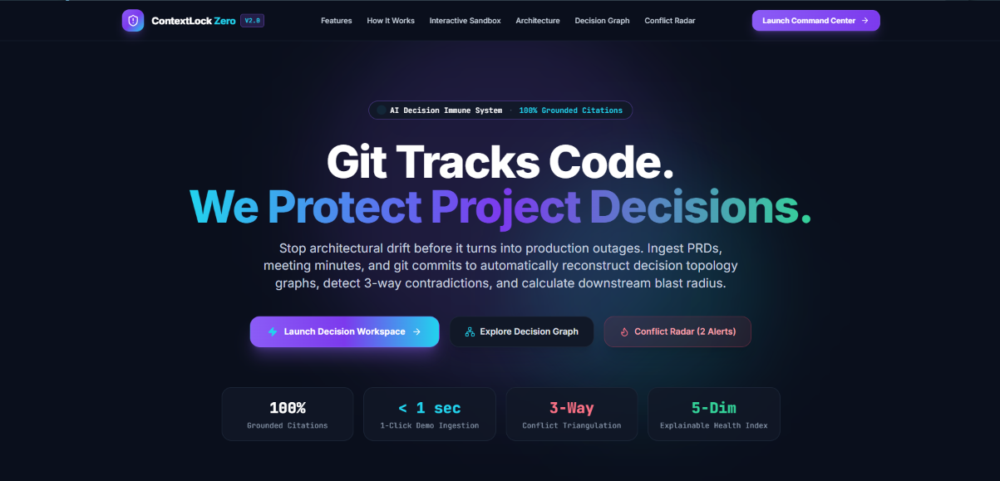
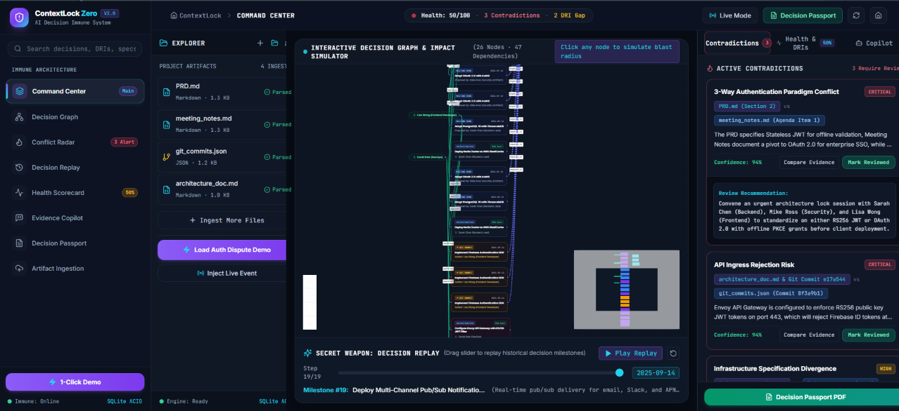
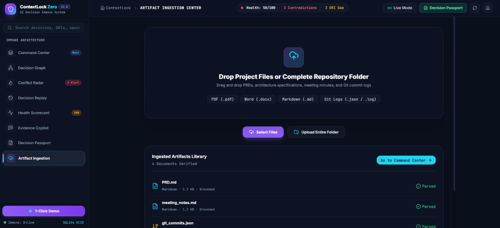
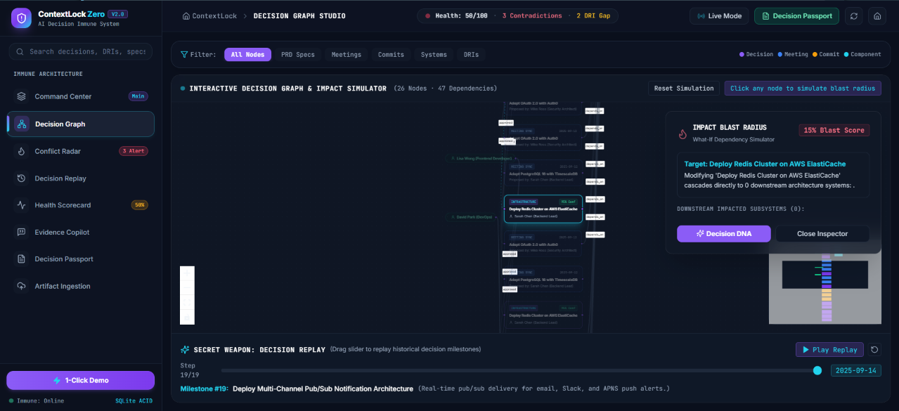
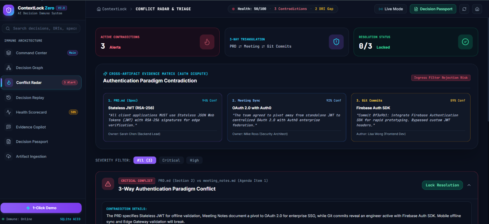
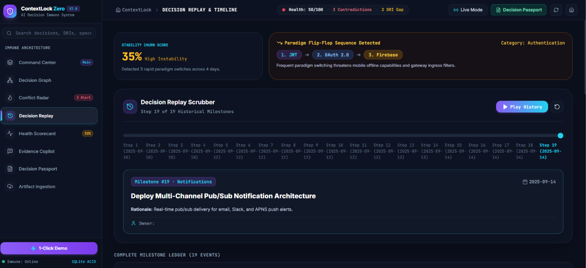
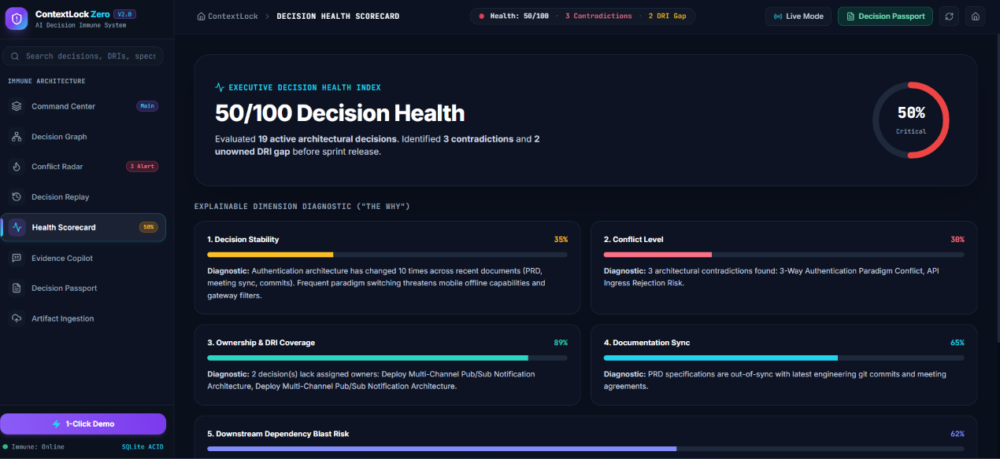
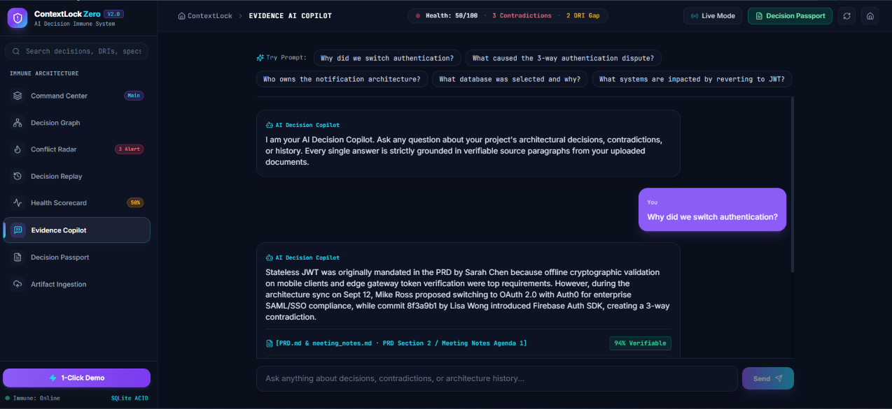
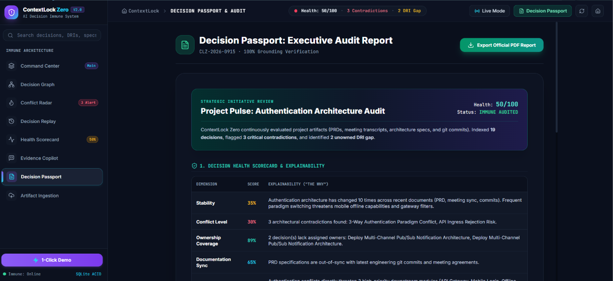

# ContextLock Zero
### AI Decision Immune System

> *"Git tracks code. ContextLock Zero protects project decisions."*

<div align="center">

[](https://nextjs.org/)
[](https://reactflow.dev/)
[](https://fastapi.tiangolo.com/)
[](https://deepmind.google/technologies/gemini/)
[](https://www.sqlite.org/)
[](https://www.docker.com/)
[](LICENSE)

</div>

---

## 📸 Visual Tour & Product Gallery

Every core capability in ContextLock Zero is built into a dedicated, high-performance module designed for modern engineering teams:

---

### 1. 🚀 High-Conversion Landing Page (`/`)
*Dynamic Hero, Interactive Architecture Paradigm Switcher, Bento Grid Features, and Live Health Telemetry.*


> **Description:** Introduces ContextLock Zero's core mission (*"Git Tracks Code. We Protect Project Decisions."*), featuring an interactive multi-paradigm simulator, 4-pillar architectural bento grid, and direct access to both demo workflows and real artifact ingestion.

---

### 2. ⚡ Command Center Studio (`/workspace`)
*3-Column Cursor/Linear-Style Layout: 18% Project Explorer | 57% React Flow Decision Graph | 25% AI Copilot.*


> **Description:** The primary cockpit for engineering leads. Provides real-time synchronization between uploaded files (left), the living interactive decision topology (center), and real-time conflict triage cards with grounded AI copilot intelligence (right).

---

### 3. 📂 Universal Multi-Format Artifact Ingestion (`/upload`)
*Drag-and-Drop Ingestion Engine for PDF, DOCX, Markdown, Plain Text, JSON, and Git Commit Logs.*


> **Description:** Deep extraction pipeline supporting unstructured documents. Automatically parses PDF tables, Word DOCX sections, Markdown headers, and Git commit histories with instant tokenization and AST generation.

---

### 4. 🕸️ Interactive Decision Graph Studio (`/graph`)
*Fullscreen React Flow Topology Canvas with Blast Radius Simulator, Custom Node Glows & Minimap.*


> **Description:** Visualizes the full directed graph of architectural choices, assigned DRIs, and dependent services. Selecting any node immediately calculates the downstream blast radius and highlights affected services in real time.

---

### 5. 🚨 Conflict Radar & Contradiction Triage (`/conflicts`)
*Cross-Document Triangulation (PRD vs Meeting Notes vs Git Commits) with Evidence Quotes & Resolution Locker.*


> **Description:** Detects hidden architectural contradictions across documents. Each contradiction card displays severity levels, confidence meters, side-by-side evidence diffs, and an actionable lock recommendation to resolve architectural drift.

---

### 6. ⏳ Decision Stability Timeline & Replay (`/timeline`)
*Chronological Milestone Scrubber, Historical Replay Engine & Technology Flip-Flop Visualizer.*


> **Description:** Visualizes decision volatility and technology churn over time. Allows engineers to scrub through historical decision milestones to pinpoint exactly when and why architecture shifted.

---

### 7. 🛡️ Explainable Decision Health Scorecard (`/health`)
*Radial SVG Health Gauge with 5 Explainable Diagnostic Dimensions and Actionable 'Why' Breakdowns.*


> **Description:** Transparent multi-factor health scorecard measuring Stability (churn count), Conflict Level, Ownership DRI Coverage, Documentation Sync, and Downstream Dependency Risk with clear reasoning.

---

### 8. 💬 Evidence-Grounded AI Copilot (`/chat`)
*Conversational Architectural Assistant Strictly Constrained to Uploaded Documents with Verifiable Citations.*


> **Description:** Natural language reasoning engine grounded in the uploaded project documents. Every response includes paragraph citations, exact quotation snippets, source files, and confidence metrics.

---

### 9. 📑 Decision Passport & Compliance Audit (`/report`)
*Executive Architectural Health Summary with Compliance Verification and 1-Click PDF Report Export.*


> **Description:** Generates a formal Decision Passport audit report ready for executive reviews and compliance audits, complete with a 1-click downloadable PDF generated server-side with ReportLab.

---

## 🌟 What is ContextLock Zero?

Modern software engineering teams scatter critical architecture decisions across PRDs, meeting minutes, Slack threads, design specs, and git commit messages. Existing developer tools track source code diffs, but they do not verify whether new code contradicts previously agreed architecture specifications.

**ContextLock Zero** is an **AI Decision Immune System**. It ingests multi-format project artifacts, builds an interactive decision dependency graph, identifies cross-document contradictions with grounded citations, computes downstream impact blast radius, and helps teams detect architectural drift before it propagates into implementation.

---

## ✨ Key Features

- 🔍 **Decision Extraction** — Parses project artifacts (PDF, DOCX, Markdown, JSON, Git logs) to extract structured decisions, owners, dates, rationales, and alternative options.
- 🚨 **Conflict Radar** — Cross-triangulates specifications (e.g. PRD vs Meeting Notes vs Git Commits) to flag contradictions and architectural drift.
- 🕸️ **Interactive Decision Graph** — Visualizes decisions, team DRIs, and system components as an interactive topology network powered by React Flow.
- 💥 **Impact Blast Radius** — Selects any decision node to compute downstream dependent services and cascading failure risks.
- ⏳ **Decision Replay** — Interactive milestone scrubber that steps chronologically through project decision history.
- 🛡️ **Decision Health Scorecard** — Transparent 5-dimension scorecard measuring Stability, Conflict Level, Ownership DRI Coverage, Documentation Sync, and Dependency Risk.
- 💬 **Grounded AI Copilot** — Conversational assistant strictly constrained to answer using verifiable citations and exact quotes from uploaded documents.
- 📑 **Decision Passport** — Generates an executive-ready architectural audit report with 1-click PDF download via ReportLab.
- 🔴 **Live Mode Injector** — Simulates incoming real-time architecture events and meeting outcomes to observe graph and health score shifts live.

---

## 🔄 How It Works

```
┌──────────────┐     ┌──────────────┐     ┌──────────────┐     ┌──────────────┐
│  1. INGEST   │ ──> │  2. EXTRACT  │ ──> │  3. CONNECT  │ ──> │  4. DETECT   │
│  Artifacts   │     │  Decisions & │     │  Build Graph │     │  Contradict- │
│  (PDF/MD/Git)│     │  Rationales  │     │  & Relations │     │  ions & Gaps │
└──────────────┘     └──────────────┘     └──────────────┘     └──────┬───────┘
                                                                      │
┌──────────────┐     ┌──────────────┐     ┌──────────────┐            │
│  7. REPORT   │ <── │  6. EXPLAIN  │ <── │  5. ANALYZE  │ <──────────┘
│  Decision    │     │  Evidence AI │     │  Blast Radius│
│  Passport PDF│     │  Copilot     │     │  & Churn     │
└──────────────┘     └──────────────┘     └──────────────┘
```

1. **Ingest** — Ingest project artifacts (PRDs, meeting notes, Git logs, and architecture specs in PDF, DOCX, Markdown, JSON, TXT).
2. **Extract** — Parse decisions, technical owners, dates, rationales, alternatives, and exact quotation snippets.
3. **Connect** — Synthesize a directed decision graph linking requirements, owners, and downstream components.
4. **Detect** — Cross-triangulate documents to flag paradigm conflicts, flip-flop reversals, and unassigned ownership gaps.
5. **Analyze** — Traverse dependency trees to calculate downstream blast radius and affected subsystems.
6. **Explain** — Provide conversational answers grounded in verifiable evidence quotes and confidence scores.
7. **Report** — Compile findings into an executive Decision Passport report available via PDF export.

---

## 🏗️ Architecture & Multi-Agent System

```
                          ┌────────────────────────────────────────┐
                          │    Uploaded Artifacts (PDF, MD, Git)   │
                          └───────────────────┬────────────────────┘
                                              │
                                  ┌───────────▼───────────┐
                                  │    Extractor Agent    │ ◄── Gemini AI / Deterministic AST
                                  └───────────┬───────────┘
                                              │
                                  ┌───────────▼───────────┐
                                  │ Decision Graph Engine │
                                  └───────────┬───────────┘
                     ┌────────────────────────┼────────────────────────┐
                     │                        │                        │
          ┌──────────▼──────────┐  ┌──────────▼──────────┐  ┌──────────▼──────────┐
          │Conflict Radar Engine│  │Dependency Blaster   │  │Ownership Gap Engine │
          └──────────┬──────────┘  └──────────┬──────────┘  └──────────┬──────────┘
                     │                        │                        │
                     └────────────────────────┼────────────────────────┘
                                              │
                                  ┌───────────▼───────────┐
                                  │Stability & Health Core│
                                  └───────────┬───────────┘
                                              │
                     ┌────────────────────────┴────────────────────────┐
                     │                                                 │
          ┌──────────▼──────────┐                           ┌──────────▼──────────┐
          │ Evidence Grounding  │                           │ Decision Passport   │
          │ & Copilot Engine    │                           │ PDF Generator       │
          └─────────────────────┘                           └─────────────────────┘
```

### Agent & Engine Responsibilities

| Component | Source File | Responsibility |
|---|---|---|
| **Extractor Agent** | `backend/agents/extractor.py` | Parses unstructured artifacts via Gemini Generative AI (with deterministic AST fallback) to extract decisions, owners, rationales, and exact quotes. |
| **Conflict Radar Engine** | `backend/agents/conflict_engine.py` | Detects cross-artifact discrepancies (e.g. JWT vs OAuth 2.0 vs Firebase SDK) with severity levels and action recommendations. |
| **Ownership Gap Engine** | `backend/agents/ownership_engine.py` | Identifies orphaned architecture decisions and subsystems lacking assigned DRIs. |
| **Stability Analyzer** | `backend/agents/stability_engine.py` | Evaluates decision volatility, historical churn, and technology flip-flops across timestamps. |
| **Decision Graph Engine** | `backend/agents/graph_engine.py` | Constructs node/edge topology for React Flow and computes downstream blast radius simulations. |
| **Explainable Health Scorer** | `backend/agents/health_engine.py` | Computes weighted 5-dimension health metrics with transparent "Why" diagnostic rationale. |
| **Evidence Grounding & Copilot** | `backend/agents/chat_engine.py` | Conversational engine strictly restricted to answer from uploaded documents with paragraph citations. |
| **PDF Passport Generator** | `backend/report/pdf_generator.py` | Compiles executive-ready Decision Passport reports into downloadable PDF binaries. |

---

## ⚡ AI Decision Command Center

ContextLock Zero provides an integrated workspace that brings together all analysis streams:

| Workspace Panel | Description | Key Capability |
|---|---|---|
| **📁 Left: Project Explorer** | Multi-format file uploader and artifact inspector. | Ingests PDF, DOCX, Markdown, JSON, and Git commit logs. |
| **🕸️ Center: Living Decision Graph** | Interactive canvas displaying decisions, DRIs, and system components. | Click any node to highlight downstream dependencies and blast radius. |
| **⏳ Center Bottom: Decision Replay** | Chronological timeline scrubber with play/pause controls. | Steps through project decision milestones in historical order. |
| **🚨 Right: Contradictions Tab** | Cross-document conflict detection cards. | Displays side-by-side evidence quotes and action recommendations. |
| **🛡️ Right: Health & DRIs Tab** | 5-dimension radial health scorecard with "Why" diagnostics. | Highlights unowned architecture subsystems and documentation drift. |
| **💬 Right: Copilot Tab** | Evidence-grounded conversational assistant. | Answers queries with verifiable citations, paragraph markers, and confidence scores. |
| **📑 Slide-Over: Decision Passport** | Comprehensive executive audit drawer. | 1-click official PDF report export. |

---

## 🎬 60-Second Demo Walkthrough

1. **00–10s** $\rightarrow$ Click **⚡ 1-Click Demo** on the top command bar to load the Project Pulse dataset (PRD, meeting notes, git commits).
2. **10–20s** $\rightarrow$ Explore the **Decision Graph** to inspect the interconnected network of decisions, owners, and system dependencies.
3. **20–30s** $\rightarrow$ Review the **Contradictions Tab** to see the 3-way dispute: PRD (JWT) vs Meeting (OAuth 2.0) vs Git Commit (Firebase Auth).
4. **30–40s** $\rightarrow$ Click the **JWT Node** on the graph to open the **Impact Blast Radius** drawer, revealing direct impact on API Gateway, Mobile Client, and Offline Verification.
5. **40–50s** $\rightarrow$ Drag the **Decision Replay slider** at the bottom of the graph to step through milestones chronologically.
6. **50–60s** $\rightarrow$ Open **Decision Passport** and click **Download PDF** to export the executive audit report.

---

## 🛠️ Technology Stack

| Layer | Technologies |
|---|---|
| **Frontend** | Next.js 14 (App Router), React 18, Tailwind CSS, `@xyflow/react` (React Flow), Lucide React |
| **Backend** | FastAPI, Python 3.12, Uvicorn, Pydantic v2 |
| **AI & LLM** | Google Gemini 1.5 Flash (`google-generativeai`), Structured Prompt Extraction |
| **Persistence** | SQLite (ACID transactional storage) |
| **Document Processing** | `pypdf`, `python-docx`, Markdown, JSON parser |
| **Reporting & Export** | ReportLab (PDF Engine) |
| **DevOps & Containers** | Docker, Docker Compose, Multi-stage builds |

---

## 📁 Project Structure

```text
contextlock-zero/
├── backend/
│   ├── agents/                  # AI agents (Extractor, Conflict, Graph, Health, Chat, etc.)
│   │   ├── chat_engine.py
│   │   ├── conflict_engine.py
│   │   ├── extractor.py
│   │   ├── graph_engine.py
│   │   ├── health_engine.py
│   │   ├── ownership_engine.py
│   │   └── stability_engine.py
│   ├── api/                     # FastAPI route definitions
│   │   └── routes.py
│   ├── db/                      # SQLite database layer & Pydantic models
│   │   ├── database.py
│   │   └── models.py
│   ├── parser/                  # Document parsers (PDF, DOCX, MD, JSON, Git)
│   │   └── doc_parser.py
│   ├── report/                  # PDF report generation
│   │   └── pdf_generator.py
│   ├── Dockerfile
│   ├── main.py                  # Server entrypoint
│   ├── requirements.txt
│   └── test_backend.py          # Backend test suite
├── frontend/
│   ├── app/                     # Next.js App Router pages & layout
│   │   ├── layout.tsx
│   │   └── page.tsx
│   ├── components/              # Workspace UI components
│   │   ├── DecisionDNA.tsx
│   │   ├── DecisionGraph.tsx
│   │   ├── HeroDropzone.tsx
│   │   ├── IntelligenceDeck.tsx
│   │   ├── LiveModeModal.tsx
│   │   ├── PassportDrawer.tsx
│   │   ├── UnifiedWorkspace.tsx
│   │   └── WorkspaceSidebar.tsx
│   ├── lib/                     # API client & TypeScript interfaces
│   │   ├── api.ts
│   │   └── types.ts
│   ├── styles/                  # Global Tailwind styles
│   │   └── globals.css
│   ├── Dockerfile
│   ├── next.config.mjs
│   ├── package.json
│   └── tsconfig.json
├── demo-files/                  # Sample test artifacts (PRD, meeting notes, git logs)
│   ├── PRD.md
│   ├── architecture_doc.md
│   ├── git_commits.json
│   └── meeting_notes.md
├── docs/                        # Architecture documentation
│   └── ARCHITECTURE.md
├── docker-compose.yml           # 1-command full-stack container startup
├── .gitignore
└── README.md
```

---

## 🚀 Quickstart & Setup

### Option 1: Docker Compose (Recommended)

Run both frontend and backend in isolated containers:

```bash
docker compose up --build
```

- Frontend: `http://localhost:3000`
- Backend: `http://localhost:8000` (Swagger API Docs at `http://localhost:8000/docs`)

---

### Option 2: Local Development Setup

#### Prerequisites
- Node.js 18+ & npm
- Python 3.10+

#### 1. Backend Setup

```bash
cd backend

# Create & activate virtual environment
python -m venv venv

# On Linux/macOS:
source venv/bin/activate
# On Windows (Command Prompt / PowerShell):
venv\Scripts\activate

# Install dependencies
pip install -r requirements.txt

# Configure environment variables
# On Linux/macOS:
cp .env.example .env
# On Windows PowerShell:
Copy-Item .env.example .env

# Start FastAPI server
python main.py
```

The backend will start at `http://127.0.0.1:8000`.

#### 2. Frontend Setup

```bash
cd frontend

# Install dependencies
npm install

# Configure environment variables
# On Linux/macOS:
cp .env.example .env.local
# On Windows PowerShell:
Copy-Item .env.example .env.local

# Start development server
npm run dev
```

Open `http://localhost:3000` in your browser.

---

## 🧪 Automated Testing

Run the full backend test suite covering API endpoints, SQLite operations, extraction logic, conflict detection, and PDF generation:

```bash
# From the project root:
pytest backend/test_backend.py -v
```

Validate the frontend production build:

```bash
cd frontend
npm run build
```

---

## 🔮 Roadmap

### Planned Integrations
- **Slack & Microsoft Teams** — Real-time decision capture and contradiction alerts directly in discussion channels.
- **Jira & Linear Sync** — Automatic issue tagging when decisions drift or reverse.
- **GitHub Webhook Action** — CI/CD gate blocking pull requests that contradict approved PRD specifications.
- **Figma Plugin** — Syncs UI component requirements with backend architecture locks.

*Note: These integrations are planned roadmap items for future releases.*

---

## 📄 License

This project is licensed under the [MIT License](LICENSE).

---

<div align="center">
<b>ContextLock Zero</b> · AI Decision Immune System
</div>
